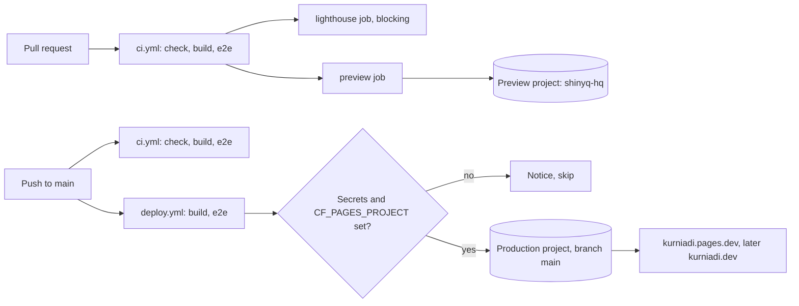

# Deploying ShinyQ HQ

The site is a Next.js static export (`out/`) hosted on Cloudflare Pages. GitHub Actions builds it and uploads it with `wrangler pages deploy` (Direct Upload). CI deploys stay off until the owner adds the two Cloudflare secrets (section 3); until then both deploy jobs log a notice and skip, and production is updated with the manual redeploy below.

## Current state (production cutover, 2026-10-09)

| Item | Value |
| --- | --- |
| Production project | `kurniadi`, Direct Upload, production branch `main` |
| Production URL | https://kurniadi.pages.dev |
| Preview project | `shinyq-hq`, Direct Upload, production branch `production-cutover-phase-6` (never pushed, so every deploy is a preview) |
| Repository variable | `CF_PAGES_PROJECT=kurniadi` (set) |
| Repository secrets | `CLOUDFLARE_API_TOKEN`, `CLOUDFLARE_ACCOUNT_ID`: not set yet, so `deploy.yml` and the `preview` job skip the upload |

The old Git-connected `kurniadi` project (old site repository, `npm run build` to `dist`) was deleted and recreated as a Direct Upload project with the same name (Option A below). Its source is still in the old site repository if it is ever needed again.

Notes:

- Per-deployment URLs such as `https://<hash>.kurniadi.pages.dev` are behind an existing Cloudflare Access application (account level, not part of the Pages project). Only `kurniadi.pages.dev` itself is public.
- The old project had automatic Cloudflare Web Analytics enabled. The new project does not. Re-enable it in the dashboard (Pages project > Metrics) or set `CF_BEACON_TOKEN` (section 4), not both.

## Manual redeploy (until CI deploys are enabled)

From a clean checkout of `main`, with `wrangler` logged in to the account that owns the project (`bunx wrangler@3 login`, once):

```sh
git switch main && git pull
bun install --frozen-lockfile
bun run typecheck && bun run lint && bun run test
NEXT_PUBLIC_SITE_URL=https://kurniadi.pages.dev bun run build
bun run e2e
bunx wrangler@3 pages deploy out --project-name=kurniadi --branch=main \
  --commit-hash="$(git rev-parse HEAD)" --commit-message="$(git log -1 --format=%s)" --commit-dirty=true
```

`--branch=main` matches the production branch, so the upload goes live on `kurniadi.pages.dev` at once. Then run the checks in section 5, step 3.

## Enable automatic CI deploys

1. Create an account-scoped API token with **Account > Cloudflare Pages > Edit** only (section 2). No zone, Workers or DNS permissions are needed.
2. Add the secrets: `gh secret set CLOUDFLARE_API_TOKEN` and `gh secret set CLOUDFLARE_ACCOUNT_ID` (section 3).
3. `CF_PAGES_PROJECT=kurniadi` is already set. Optionally set `SITE_URL` and `CF_BEACON_TOKEN` (section 4).
4. Run `gh workflow run deploy.yml --ref main` and watch it with `gh run watch`. From then on every push to `main` deploys to production, and every pull request from this repository gets a preview on `shinyq-hq`.

## Overview

| Trigger | Workflow | Cloudflare project | Result |
| --- | --- | --- | --- |
| Pull request from this repo | `ci.yml` job `preview` | `CF_PREVIEW_PROJECT` (default `shinyq-hq`) | Preview URL `pr-<n>.<project>.pages.dev` |
| Push to `main`, or manual run | `deploy.yml` | `CF_PAGES_PROJECT` (for example `kurniadi`) | Production at `SITE_URL` (default `https://kurniadi.pages.dev`) |
| Every CI run | `ci.yml` job `lighthouse` (`Lighthouse CI`) | none | Lighthouse budgets (blocking) and reports as an artifact |



`ci.yml` still runs typecheck, lint and unit tests on every push to `main`. `deploy.yml` runs its own build and Playwright smoke tests so a broken export never reaches production.

## 1. Choose the Pages project

Done for production on 2026-10-09 (see "Current state"); kept for reference. The production URL `kurniadi.pages.dev` belongs to the Cloudflare Pages project named `kurniadi`. A `*.pages.dev` subdomain is tied to the project name and cannot be moved to another project. Deleting a project frees its name at once: the cutover deleted and recreated `kurniadi` within seconds.

### Option A: reuse `kurniadi` (keeps kurniadi.pages.dev)

1. In the Cloudflare dashboard open Workers & Pages, then the `kurniadi` project, then Settings.
2. Check how it is deployed:
   - **Direct Upload project** (no Git repository shown under Settings > Builds): wrangler can deploy to it as is. Go to step 3.
   - **Git-connected project** (connected to the old site repository): wrangler Direct Upload is not allowed into a Git-integrated project. Cloudflare does not let you convert it, so the clean path is:
     1. Back up the old site first: download the latest deployment (or keep the old repository and its build command) so you can recreate it.
     2. Delete the `kurniadi` project (Settings > Delete project). This frees the name and the `kurniadi.pages.dev` subdomain. The old site is offline from this point until the first deploy.
     3. Recreate it immediately as a Direct Upload project with the same name:
        ```sh
        bunx wrangler@3 pages project create kurniadi --production-branch=main
        ```
     4. Run the first deploy (section 5) right away to keep the downtime short.
3. Make sure the production branch is `main` (Settings > Builds and deployments > Production branch, or recreate with `--production-branch=main`). If it is anything else, deploys from `deploy.yml` are published as previews and the production URL does not change.

Rollback note: if the new site has a problem after the cut-over, use the dashboard rollback (section 6). If you need the old site back entirely, redeploy the backup to the same project with `bunx wrangler@3 pages deploy <backup-dir> --project-name=kurniadi --branch=main`.

### Option B: create a new project

Use this to try production deploys without touching the old site, then switch later.

```sh
bunx wrangler@3 login
bunx wrangler@3 pages project create <name> --production-branch=main
```

The site is then served at `https://<name>.pages.dev`. Set `SITE_URL` to that URL (section 4) so canonical links and the sitemap match.

## 2. Create an API token and find the Account ID

1. Cloudflare dashboard > My Profile > API Tokens > Create Token > Create Custom Token.
2. Permissions: **Account**, **Cloudflare Pages**, **Edit**.
3. Account Resources: Include, your account (account scope, no zone needed).
4. Create the token and copy it once.
5. Account ID: Workers & Pages overview page, right sidebar ("Account ID"), or the dashboard URL `dash.cloudflare.com/<account-id>/...`.

## 3. GitHub repository secrets

Settings > Secrets and variables > Actions > Secrets, or with `gh`:

```sh
gh secret set CLOUDFLARE_API_TOKEN      # paste the token from step 2
gh secret set CLOUDFLARE_ACCOUNT_ID     # paste the account id
gh secret set SAFETY_BLOCKLIST < content/.safety-blocklist.local.txt   # optional, existing
```

| Secret | Required | Purpose |
| --- | --- | --- |
| `CLOUDFLARE_API_TOKEN` | Yes, for any deploy | Pages Edit token used by wrangler |
| `CLOUDFLARE_ACCOUNT_ID` | Yes, for any deploy | Cloudflare account that owns the projects |
| `SAFETY_BLOCKLIST` | Optional | Private public-safety blocklist terms (private repo and cloud resource names) used by the content tests and the e2e scan of `out/`; product names in `content/safety-allowlist.txt` are dropped from it |

## 4. GitHub repository variables

Settings > Secrets and variables > Actions > Variables, or with `gh`:

```sh
gh variable set CF_PAGES_PROJECT --body kurniadi
gh variable set CF_PREVIEW_PROJECT --body shinyq-hq            # optional
gh variable set SITE_URL --body https://kurniadi.pages.dev     # optional
gh variable set CF_BEACON_TOKEN --body <web-analytics-token>   # optional
```

| Variable | Required | Purpose |
| --- | --- | --- |
| `CF_PAGES_PROJECT` | Yes, to enable production deploys | Production Pages project name. While unset, `deploy.yml` builds and tests but skips the upload. |
| `CF_PREVIEW_PROJECT` | Optional | Project for PR previews. Defaults to `shinyq-hq` (created automatically with a production branch that is never pushed, so every deploy stays a preview). |
| `SITE_URL` | Optional | Public origin baked into canonical URLs, `hreflang`, sitemap, robots and OG URLs (`NEXT_PUBLIC_SITE_URL`). Defaults to `https://kurniadi.pages.dev`. Set to `https://kurniadi.dev` after the domain move. |
| `CF_BEACON_TOKEN` | Optional | Cloudflare Web Analytics site token (`NEXT_PUBLIC_CF_BEACON_TOKEN`). When empty, no beacon is rendered. |

Web Analytics token: Cloudflare dashboard > Analytics & Logs > Web Analytics > Add a site, choose the manual JS snippet, and copy the `token` value from the snippet. Alternatively enable automatic Web Analytics on the Pages project (Pages project > Metrics) and leave `CF_BEACON_TOKEN` unset. Use one or the other, not both, or every visit is counted twice.

The Content-Security-Policy in `public/_headers` already allows `static.cloudflareinsights.com` (script) and `cloudflareinsights.com` (beacon reports).

## 5. First deploy

1. Merge the PR to `main`, or run the workflow manually: Actions > Deploy > Run workflow (or `gh workflow run deploy.yml --ref main`).
2. Follow the run: `gh run watch`. The `deploy` job shows the deployment URL in its summary and the `production` environment links to `SITE_URL`.
3. Verify (replace the host if you use another project):

```sh
HOST=https://kurniadi.pages.dev
curl -sI "$HOST/" | head -n1                         # 200, static language redirect page
curl -sI "$HOST/en" | head -n1                       # 200
curl -sI "$HOST/id" | head -n1                       # 200
curl -sI "$HOST/cv.pdf" | grep -iE '^(HTTP|location)' # 301 to /cv/kurniadi-ahmad-wijaya-cv.pdf
curl -sI "$HOST/cv/kurniadi-ahmad-wijaya-cv.pdf" | grep -iE '^(HTTP|content-type|x-frame-options)' # 200, application/pdf, SAMEORIGIN
curl -s "$HOST/sitemap.xml" | head -n5               # URLs use SITE_URL
curl -s "$HOST/robots.txt"
curl -sI "$HOST/og/en.png" | grep -i content-type    # image/png (share card)
curl -sI "$HOST/en" | grep -iE 'content-security-policy|strict-transport|x-frame-options'
```

Then open `/` in a browser (it redirects to `/en` or `/id`), switch languages, and check the browser console for CSP violations.

## 6. Rollback

- Fastest: Cloudflare dashboard > Workers & Pages > project > Deployments, pick an earlier production deployment, then Rollback to this deployment. No rebuild needed.
- From GitHub: open an earlier successful Deploy run and choose Re-run all jobs. It rebuilds that commit and deploys it. Or revert the commit on `main`, which triggers a normal deploy.

## 7. Custom domain kurniadi.dev (later)

1. Pages project > Custom domains > Set up a custom domain: add `kurniadi.dev`, and `www.kurniadi.dev` if wanted.
2. DNS: if the zone is on Cloudflare, Pages creates the records for you. Otherwise add `CNAME kurniadi.dev -> <project>.pages.dev` (the apex works through CNAME flattening when the zone is on Cloudflare; other DNS hosts need ALIAS/ANAME support) and `CNAME www -> <project>.pages.dev`.
3. `gh variable set SITE_URL --body https://kurniadi.dev`, then redeploy (`gh workflow run deploy.yml --ref main`) so canonical URLs, `hreflang`, the sitemap and OG URLs use the new origin.
4. Optional: send `kurniadi.pages.dev` to the custom domain with a Cloudflare Bulk Redirect (Rules > Redirect Rules > Bulk Redirects, source `kurniadi.pages.dev`, target `https://kurniadi.dev`, preserve path and query). `_redirects` cannot do this because it cannot match on host names.
5. Optional: redirect `www.kurniadi.dev` to the apex with a Redirect Rule in the zone.

## 8. Lighthouse CI

- Job `lighthouse` (check name `Lighthouse CI`) in `ci.yml` runs after the `site` build on every PR and push. It downloads the `site` artifact, serves it with `scripts/serve-static.ts` on port 4320 and runs `@lhci/cli` (pinned in the workflow) with `lighthouserc.json`.
- Pages: `/en`, `/en/quick`, `/en/labs/voice-ai-contact-center`, 3 runs each, Lighthouse default mobile profile (simulated 4G, mid-range device).
- Budgets (appendix 08): LCP under 2500 ms, CLS under 0.05, TBT under 300 ms (error level, median run); performance score at least 0.8, accessibility at least 0.9 and SEO at least 0.9 (warn level).
- Reports: the run summary lists the assertion results, and the HTML and JSON reports are in the `lighthouse-reports` artifact (Actions run > Artifacts). Reports are written to the filesystem only and are never uploaded to public temporary storage.
- Local run after `bun run build:web`: `bunx @lhci/cli@0.15.1 autorun` (needs a local Chrome), then open `.lighthouseci/*.report.html`.
- Blocking: a failed error-level budget fails `Lighthouse CI`, and the aggregate `Build, CV and e2e` job (the required check) needs it, so a PR cannot merge over budget. Branch rules may also list `Lighthouse CI` directly.
- LCP is simulated (Lantern): the slow-4G model counts every request that finished before the observed paint. Two build-time measures keep the hero inside the budget, so keep them when changing fonts or the build: the preloaded fonts are self-hosted cuts narrowed to the axes the site uses (`src/assets/fonts/README.md`, about 110 KB for all three), and `scripts/defer-scripts.ts` (run by `bun run build`) requests the Next.js chunks only after the first contentful paint. Medians at the time of writing: about 2.1 s on `/en` and the pod page, 2.25 s on `/en/quick`.

## 9. Headers and redirects

Files in `public/` are copied to `out/` by `next build`, and Cloudflare Pages reads `out/_headers` and `out/_redirects`.

`public/_headers`:

- `/*`: security headers (`X-Content-Type-Options`, `Referrer-Policy`, `X-Frame-Options`, `Permissions-Policy`, `Strict-Transport-Security`, `Cross-Origin-Opener-Policy`) and a Content-Security-Policy. `script-src` needs `'unsafe-inline'` because the static export inlines Next.js hydration data, the root language redirect script and JSON-LD. `blob:` is allowed for workers and media used by WebGL and audio.
- `/_next/static/*`: one year, `immutable` (file names are content hashed; this also covers the self-hosted `next/font` files).
- `/cv/*`: the CV PDF is previewed in an iframe on `/{locale}/cv`, so this rule detaches the site-wide `Content-Security-Policy` and `X-Frame-Options` (`! Header`) and sets `frame-ancestors 'self'` and `SAMEORIGIN` instead: same-origin framing only. The site CSP allows it with `frame-src 'self'` and keeps `object-src 'none'`.
- `/brand/*`: one week. `/cv/*`: one hour, so a replaced CV shows up quickly. `/og/*`: one day for Open Graph images emitted under `/og/`. Splats only work at the end of a path, so per-route images such as `/en/opengraph-image` keep the default caching.
- HTML keeps the Cloudflare default (revalidated on every request), so a new deploy is visible at once.

`public/_redirects`:

- `/cv.pdf` (the old site's path), `/en/cv.pdf`, `/id/cv.pdf` and the former per-locale PDFs `/cv/kurniadi-ahmad-wijaya-cv-{en,id}.pdf` to `/cv/kurniadi-ahmad-wijaya-cv.pdf` (301).
- `/` is intentionally not redirected: it is a static page that picks the language on the client.

`scripts/serve-static.ts` honors simple static rules from `out/_redirects` so `e2e/deploy.spec.ts` can check the CV redirects locally. Headers are only applied by Cloudflare; the e2e test checks that `out/_headers` is exported.
