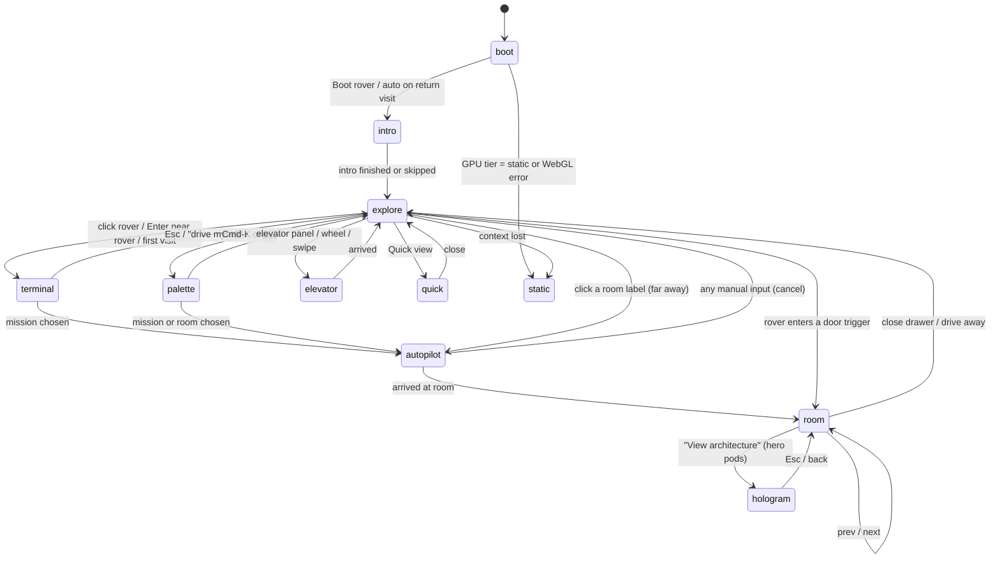

# Appendix 02: Interaction Model and State Machine

Part of [Agent HQ design spec](../2026-10-09-agent-hq-design.md).

## 1. Experience states



`palette` and `quick` are overlays: they pause input to the world but keep rendering. `static` is a terminal state for the session and shows the HTML-only experience.

## 2. Transition rules

| From → To | Visual | Duration | Reduced motion |
|---|---|---|---|
| boot → intro | Boot lines type out (max 6 lines), then a CRT-off flash | 1.2 s (skippable) | Instant |
| intro → explore | Exterior orbit and fly-in (see appendix 01) | 2.5 s | 200 ms fade |
| explore → elevator → explore | Rover drives to the door, doors close, camera dollies vertically, doors open | Drive time + 0.8 s dolly | 150 ms fade cut |
| autopilot step | Rover follows the navgrid path at autopilot speed | Distance-based | Same, but no camera sway |
| → room | Rover plants its flag, the room hologram brightens, the drawer slides in | 300 ms | Instant drawer |
| room → hologram | Camera flies into the pod, the world dims to 25%, the diagram assembles node by node | 900 ms | Diagram appears instantly |
| any → static | Notice toast "Switched to lite view" | | |

## 3. Missions

A mission is a list of steps run by `missions/runner.ts`:

```ts
type MissionStep =
  | { kind: "elevator"; floor: FloorId }
  | { kind: "drive"; to: RoomId | Vec2 }
  | { kind: "open"; room: RoomId; tab?: DrawerTab }
  | { kind: "say"; text: LocalizedText; ms?: number }; // rover screen text
```

- Each step resolves when complete. The runner exposes `start(missionId)`, `cancel()` and a `status` (`idle | running | done | cancelled`).
- Manual input during `running` calls `cancel()`. The rover face shows `o_o` for 600 ms, then control returns.
- The `surprise` mission picks a random unvisited room, weighted toward hero pods.

### Mission catalog (v1)

| id | Label (EN) | Steps |
|---|---|---|
| `best-ai` | Show me your best AI work | elevator L3 → drive to the door of the top AI Wing hero pod → open overview |
| `best-swe` | Show me your software engineering | elevator L3 → drive to the door of the top Software Wing hero pod → open overview |
| `journey` | Walk me through your journey | elevator L2 → drive to 2019 → `say` "drive or swipe forward through time" |
| `projects` | All projects | elevator L3 → stop in the atrium → open the palette filtered to pods |
| `hire` | Hire / contact | elevator RF → drive to the comms terminals → open contact |
| `cv` | Download CV | elevator RF → drive to the CV kiosk → open the CV drawer |
| `blog` | Read the blog | elevator L4 → drive to the shelves → open the latest post |
| `surprise` | Surprise me | random, as above |

Software engineering and AI engineering get equal billing: `best-swe` and `best-ai` are always the first two options (their order alternates per visit).

### Quests (v1.1, out of v1 scope)

The dossier also proposes 14 story-driven "quests" (for example "Interrupt the voice agent", "Fix the 45%", "Solve the 21-second mystery", "Origin story", "Trophy hunt"). They reuse the same step runner plus a quest log in the HUD. They are designed but deferred to v1.1, so v1 ships with the utility missions above.

## 4. Rover Terminal

- **Open:** click or tap the rover, press Enter when the rover is focused, or automatically on the first visit after the intro.
- **Layout:** a terminal window anchored to the rover's screen (desktop) or a bottom sheet (mobile). The prompt is `rover@hq:~$ ./missions`.
- **Greeting:** chosen by time of day in the visitor's locale ("good morning", "good evening") plus "where should we go? ^_^".
- **Options:** numbered 1 to 8 from the mission catalog, plus "drive myself". Input by number keys, arrow keys plus Enter, or tap. `Esc` closes it.
- **Typing effect:** 12 ms per character. The full text shows immediately on the second open or under reduced motion.

## 5. Command palette

- **Open:** `⌘K` / `Ctrl+K`, `/`, or the search button in the HUD.
- **Index:** missions, rooms (all floors), years, actions (`Download CV`, `Copy email`, `Toggle language`, `Toggle sound`, `Quick view`).
- **Search:** fuzzy matching over title, tags, stack and year, in both languages. Results are grouped by type with a floor badge.
- **Empty query:** shows the missions, then "Recent" (last 3 visited rooms).
- **Keyboard:** up/down to move, Enter to run, Esc to close, Tab to jump between groups.

## 6. Room drawer

| Property | Spec |
|---|---|
| Tabs | Overview, Architecture, Results, Stack. Year rooms and Library items use a single-pane variant. |
| Header | Floor and room code (mono), title, role and period, tier badge |
| Metric tiles | 1 to 3 tiles, each with the value, the label and the context (e.g. "controlled A/B, n=4") |
| Actions | "Full case study" (route link), "View architecture" (hero pods only), prev/next, close |
| Focus | Focus moves into the drawer on open and returns to the canvas on close. Esc closes it. |
| URL | Opening updates the URL with `history.pushState`. Closing restores the floor URL. |

## 7. Hologram view

- Available only for pods with `tier === "hero"` and at least 3 architecture nodes.
- Nodes are laid out by `layer` (columns) and `row`, with no automatic graph layout.
- Packets travel along edges at 2 u/s. Edges marked `async` are dashed.
- Results float as cards to the right of the diagram, or below it on portrait screens.
- Navigation: ←/→ or a horizontal swipe moves to the previous/next hero pod. Esc returns to the drawer.

## 8. README easter egg

- Press `t` inside any room (or tap "README" in the drawer's overflow menu) to toggle the terminal view of the same content.
- The ASCII architecture is generated from the same `architecture` data, using box-drawing characters.
